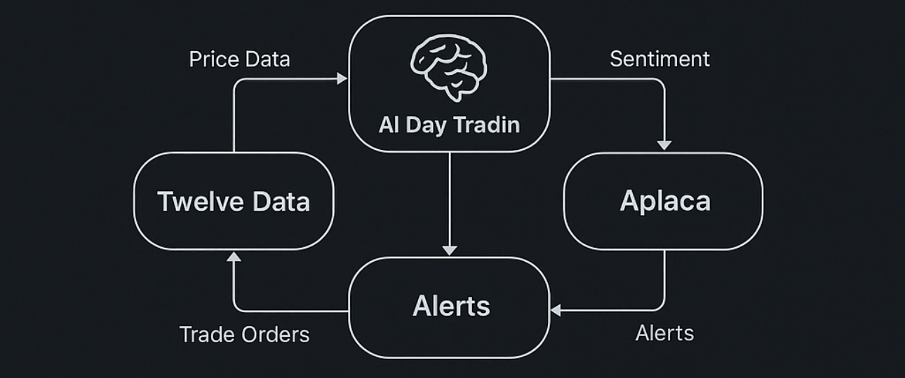

# SentimentTrade

## Overview
An Al-driven day trading bot that analyzes stock sentiment, price data, and technical indicators (moving averages, VWAP) to send trade orders and alefts.
## Instructions
- Clone gith-rep guthwb.com/readi-agent*
- Navigate to the directory
- Create and activate a virtual enivenment
- Install dependencies:
  - OPENAI_API_KEY
  - ALPACA_API_KEY
  - ALPACA_SECRET_KEY
  - TELEGRAM_TOKEN
  - TELEGRAM_CHAT ID
  - TWELVE_DATA_API_KEY
- Configuration: Adjust stock stmbols. Technical Indicator parameters & thresholds in bot. py or un bot.py.
Running the Bot: Execute bot. run python bot. py.
Making Changes: Modity pot. py.
- Test your changes locally, or commit changes
- Push your changes git push.
## Troubleshooting
Debugging on VM: SSH into over VM §gloud compute ssh your-vm-name or ssh user@om-ip, to sch utilities)
