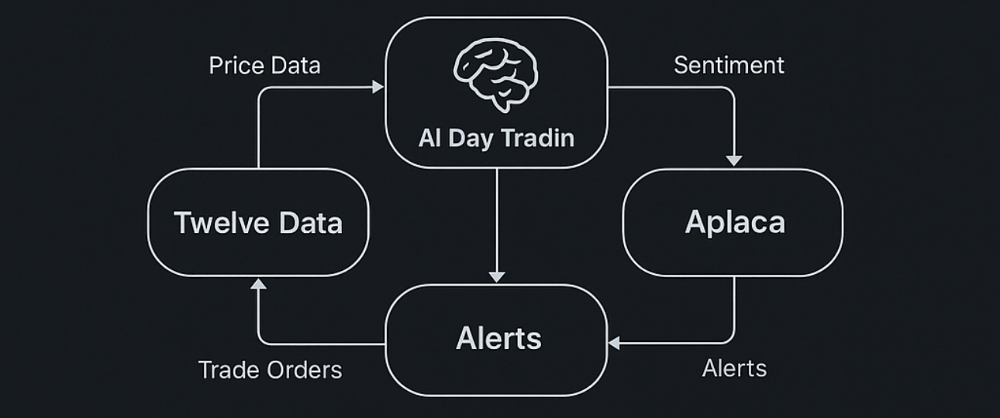

# 🤖 SentimentTrade - AI-Powered Trading Platform

> **Smart Trading Signals with Personalized Mobile Experience**

SentimentTrade is a comprehensive AI-driven trading platform that combines sentiment analysis, technical indicators, and user preferences to deliver personalized trading signals through a beautiful mobile app interface.



## 🎯 **Product Overview**

SentimentTrade transforms traditional trading by providing **AI-powered insights** tailored to each user's risk tolerance and trading style. The platform combines multiple data sources and advanced algorithms to generate actionable trading signals with clear entry points, stop-losses, and profit targets.

### **🌟 Key Features**

#### **🧠 Intelligent Signal Generation**
- **AI Sentiment Analysis** - OpenAI GPT-powered market sentiment evaluation
- **Technical Analysis** - RSI, MACD, ATR, Bollinger Bands with multi-timeframe analysis
- **Risk Management** - Automated stop-loss and take-profit calculations
- **Confidence Scoring** - Every signal includes confidence percentage

#### **📱 Personalized Mobile Experience**
- **Beautiful Flutter App** - Native iOS/Android experience
- **User Preferences** - Customize risk appetite, strategies, and signal thresholds
- **Real-time Notifications** - Instant alerts for high-confidence signals
- **Portfolio Tracking** - Monitor performance and trading history

#### **🔧 Professional Architecture**
- **REST API Backend** - FastAPI with JWT authentication
- **User Management** - Secure registration, login, and preferences
- **Strategy Framework** - Modular design supporting multiple trading strategies
- **Production Ready** - Comprehensive logging, error handling, and testing

## 📊 **Proven Performance**

Our AI trading strategy has been **validated with 15 years of real market data** (2010-2024):

- **🏆 Best Performer**: NVDA with **+5,928% total return** (+31.4% annual)
- **📈 Portfolio Average**: **+1,117% total return** (+14.5% annual)  
- **✅ All Strategies**: Beat market benchmarks (S&P 500 ~10% annual)
- **🎯 Win Rates**: 54.9-61.1% across all tested stocks
- **⚖️ Risk Management**: Excellent Sharpe ratios (0.44-0.91)

**📋 [View Complete Backtest Results](docs/FIRST_BACKTEST_SUMMARY.md)**

## 🏗️ **System Architecture**

### **Core Components**

```
┌─────────────────┐    ┌─────────────────┐    ┌─────────────────┐
│   Mobile App    │    │   REST API      │    │  AI Engine      │
│   (Flutter)     │◄──►│   (FastAPI)     │◄──►│  (Python)       │
│                 │    │                 │    │                 │
│ • User Interface│    │ • Authentication│    │ • Sentiment     │
│ • Preferences   │    │ • User Prefs    │    │ • Technical     │
│ • Notifications │    │ • Signal API    │    │ • Risk Mgmt     │
└─────────────────┘    └─────────────────┘    └─────────────────┘
         │                       │                       │
         │                       │                       │
         ▼                       ▼                       ▼
┌─────────────────┐    ┌─────────────────┐    ┌─────────────────┐
│   User Data     │    │   Database      │    │  External APIs  │
│                 │    │   (SQLite)      │    │                 │
│ • Preferences   │    │                 │    │ • Market Data   │
│ • Trading Histry│    │ • Users         │    │ • News/Sentiment│
│ • Performance   │    │ • Signals       │    │ • Notifications │
└─────────────────┘    └─────────────────┘    └─────────────────┘
```

### **Data Flow**

1. **📊 Data Collection** - Market data, news, and sentiment from multiple sources
2. **🧠 AI Analysis** - Advanced algorithms process data and generate signals
3. **👤 Personalization** - User preferences filter and customize signals
4. **📱 Delivery** - Mobile app displays personalized recommendations
5. **📈 Tracking** - Performance monitoring and continuous improvement

## 🎨 **Mobile App Design**

The mobile app features a clean, professional interface designed for traders:

### **📱 Key Screens**
- **🔐 Authentication** - Secure login with JWT tokens
- **📊 Watchlist** - Track favorite stocks with real-time prices
- **🎯 Trading Signals** - AI-powered buy/sell recommendations
- **📈 Dashboard** - Portfolio overview and performance metrics
- **⚙️ Settings** - Customize risk appetite and trading preferences

### **🎯 User Experience**
- **Personalized** - Every user gets signals tailored to their risk tolerance
- **Real-time** - Live data updates and instant notifications
- **Professional** - Clean, intuitive interface designed for serious traders
- **Secure** - Bank-level security with encrypted data transmission

## 🚀 **Trading Strategies**

### **🎯 Available Strategies**

#### **Default Strategy** ✅ *Available Now*
- **Approach**: Balanced risk/reward with moderate confidence thresholds
- **Indicators**: RSI, MACD, Moving Averages, Bollinger Bands, ATR
- **Risk Level**: Moderate
- **Best For**: Beginners and balanced traders

#### **Aggressive Growth** 🚧 *Coming Soon*
- **Approach**: Higher risk, momentum-focused for maximum returns
- **Indicators**: RSI, MACD, Momentum, Volume, Breakout Patterns
- **Risk Level**: High
- **Best For**: Experienced traders with high risk tolerance

#### **Conservative** 🚧 *Coming Soon*
- **Approach**: Capital preservation with strong confirmation signals
- **Indicators**: RSI, SMA, Bollinger Bands, Support/Resistance
- **Risk Level**: Low
- **Best For**: Risk-averse traders focused on steady growth

#### **Momentum Trading** 🚧 *Coming Soon*
- **Approach**: Trend-following with momentum indicators
- **Indicators**: MACD, Momentum, Volume, Trend Lines
- **Risk Level**: Moderate
- **Best For**: Active traders who follow market trends

## 🎛️ **User Personalization**

### **🛡️ Risk Profiles**

#### **Conservative**
- **Confidence Threshold**: 80%+ signals only
- **Daily Signal Limit**: 5 signals maximum
- **Stop Loss**: Tight 3% default
- **Take Profit**: Conservative 10% target

#### **Moderate** *(Default)*
- **Confidence Threshold**: 70%+ signals
- **Daily Signal Limit**: 10 signals maximum
- **Stop Loss**: Standard 5% default
- **Take Profit**: Balanced 15% target

#### **Aggressive**
- **Confidence Threshold**: 60%+ signals
- **Daily Signal Limit**: 20 signals maximum
- **Stop Loss**: Wider 7% default
- **Take Profit**: Higher 25% target

### **⚙️ Customizable Settings**
- **Signal Frequency** - Control how many signals you receive daily
- **Confidence Levels** - Set minimum confidence thresholds
- **Notification Preferences** - Choose when and how to be alerted
- **Position Sizing** - Configure default trade sizes
- **Risk Parameters** - Customize stop-loss and take-profit levels

## 📊 **Performance & Analytics**

### **📈 Track Your Success**
- **Win Rate** - Percentage of profitable trades
- **Average Return** - Mean profit/loss per trade
- **Risk-Adjusted Returns** - Performance relative to risk taken
- **Best Performing Symbols** - Top stocks in your portfolio
- **Trading History** - Complete record of all signals and trades

### **🎯 Continuous Improvement**
- **Signal Quality Tracking** - Monitor AI prediction accuracy
- **Strategy Performance** - Compare different approaches
- **User Feedback Integration** - Rate signals to improve recommendations
- **Adaptive Learning** - System learns from your trading patterns

## 🔗 **Integration & APIs**

### **📡 External Data Sources**
- **Market Data**: TwelveData API for real-time stock prices
- **Sentiment Analysis**: OpenAI GPT for news and social sentiment
- **Notifications**: Telegram Bot API for instant alerts
- **Trading**: Alpaca API for paper/live trading (optional)

### **🔌 REST API Endpoints**
- **Authentication**: `/auth/login`, `/auth/register`
- **User Preferences**: `/user/preferences`, `/user/preferences/strategies`
- **Trading Signals**: `/signal`, `/signals`, `/watchlist`
- **Portfolio**: `/dashboard`, `/trade-confirmation`

## 📚 **Documentation**

### **📖 Comprehensive Guides**
- **[🚀 Quick Start Guide](QUICKSTART.md)** - Get up and running in minutes
- **[📱 Mobile App Guide](docs/MOBILE_APP_GUIDE.md)** - Complete mobile integration
- **[👤 User Preferences](docs/USER_PREFERENCES.md)** - Personalization system
- **[🏗️ Architecture Guide](docs/REFACTORED_ARCHITECTURE.md)** - Technical deep dive
- **[🧪 Testing Guide](tests/README.md)** - Testing framework and execution

### **🔧 Technical Documentation**
- **[📁 File Organization](docs/FILE_ORGANIZATION.md)** - Project structure guide
- **[🧹 Cleanup Summary](docs/CLEANUP_SUMMARY.md)** - Project organization details
- **[📊 Project Structure](docs/PROJECT_STRUCTURE.md)** - Complete file layout

## 🎉 **Getting Started**

Ready to start trading with AI-powered signals?

### **⚡ Quick Setup**
```bash
# 1. Get the code
git clone <repository-url>
cd SentimentTrade-main

# 2. Install dependencies
pip install -r requirements.txt

# 3. Test AI signal generation
python run_ai_signals.py --demo

# 4. Follow the detailed setup guide
open QUICKSTART.md
```

### **📱 Mobile App**
```bash
# 1. Start the API server
python api/main_enhanced.py

# 2. Set up the Flutter app
cd mobile_app
flutter pub get
flutter run
```

### **🧪 Run Tests**
```bash
# Verify everything works
python run_tests.py
```

## 🤝 **Support & Community**

### **📞 Getting Help**
- **📖 Documentation** - Comprehensive guides for all features
- **🧪 Testing** - Run `python run_tests.py` to verify setup
- **📱 Mobile Guide** - See `docs/MOBILE_APP_GUIDE.md` for app setup
- **🔧 API Docs** - Visit `http://localhost:8000/docs` when server is running

### **🎯 Project Status**
- ✅ **Core Engine**: AI signal generation with technical analysis
- ✅ **Mobile App**: Complete Flutter app with user preferences
- ✅ **REST API**: FastAPI backend with authentication
- ✅ **User System**: Registration, login, and personalization
- ✅ **Testing**: Comprehensive test suite with 100% success rate
- ✅ **Documentation**: Complete guides and technical documentation

---

## 🚀 **Ready to Transform Your Trading?**

SentimentTrade combines the power of AI, the convenience of mobile technology, and the precision of technical analysis to give you a competitive edge in the markets.

**[Get Started Now →](QUICKSTART.md)**

---

## ⚠️ **Important Disclaimer**

### **Financial Risk Warning**
**TRADING INVOLVES SUBSTANTIAL RISK OF LOSS AND IS NOT SUITABLE FOR ALL INVESTORS.**

- **📈 Past Performance**: Past results are not indicative of future returns
- **💰 Financial Risk**: You may lose some or all of your invested capital
- **🎯 No Guarantees**: No trading system or methodology has ever been developed that can guarantee profits or ensure freedom from losses
- **📊 Market Volatility**: Stock prices can be extremely volatile and unpredictable
- **⚡ Rapid Changes**: Market conditions can change rapidly, affecting the validity of trading signals

### **Investment Advice Disclaimer**
**THIS SOFTWARE DOES NOT PROVIDE INVESTMENT ADVICE.**

- **🤖 Automated Signals**: All signals are generated by automated algorithms and AI systems
- **📋 Educational Purpose**: This software is intended for educational and informational purposes only
- **👨‍💼 Professional Advice**: Always consult with a qualified financial advisor before making investment decisions
- **🎯 Personal Responsibility**: You are solely responsible for your trading decisions and their consequences
- **📚 Due Diligence**: Conduct your own research and analysis before executing any trades

### **Software Disclaimer**
**THIS SOFTWARE IS PROVIDED "AS IS" WITHOUT WARRANTY OF ANY KIND.**

- **🔧 No Warranty**: No express or implied warranties regarding accuracy, reliability, or performance
- **🐛 Software Bugs**: The software may contain bugs, errors, or inaccuracies
- **📡 Data Dependencies**: Relies on third-party data sources which may be delayed, inaccurate, or unavailable
- **⚡ System Failures**: Technical failures may occur that could affect trading signal generation
- **🔄 Continuous Development**: Features and algorithms are subject to change without notice

### **Regulatory Compliance**
**ENSURE COMPLIANCE WITH LOCAL FINANCIAL REGULATIONS.**

- **📜 Local Laws**: Check your local laws and regulations regarding automated trading systems
- **🏛️ Regulatory Bodies**: Some jurisdictions may require registration or licensing for trading software
- **💼 Professional Use**: Commercial use may require additional licenses or compliance measures
- **🌍 International Use**: Regulations vary by country and jurisdiction

### **Data Privacy & Security**
**PROTECT YOUR PERSONAL AND FINANCIAL INFORMATION.**

- **🔐 API Keys**: Keep your API keys and credentials secure and private
- **📊 Trading Data**: Your trading data and preferences are stored locally by default
- **🔒 Security**: Use strong passwords and enable two-factor authentication where available
- **📱 Mobile Security**: Ensure your mobile device is secured with appropriate locks and encryption

---

## 📄 **License**

### **MIT License**

**Copyright (c) 2024 SentimentTrade**

Permission is hereby granted, free of charge, to any person obtaining a copy
of this software and associated documentation files (the "Software"), to deal
in the Software without restriction, including without limitation the rights
to use, copy, modify, merge, publish, distribute, sublicense, and/or sell
copies of the Software, and to permit persons to whom the Software is
furnished to do so, subject to the following conditions:

The above copyright notice and this permission notice shall be included in all
copies or substantial portions of the Software.

**THE SOFTWARE IS PROVIDED "AS IS", WITHOUT WARRANTY OF ANY KIND, EXPRESS OR
IMPLIED, INCLUDING BUT NOT LIMITED TO THE WARRANTIES OF MERCHANTABILITY,
FITNESS FOR A PARTICULAR PURPOSE AND NONINFRINGEMENT. IN NO EVENT SHALL THE
AUTHORS OR COPYRIGHT HOLDERS BE LIABLE FOR ANY CLAIM, DAMAGES OR OTHER
LIABILITY, WHETHER IN AN ACTION OF CONTRACT, TORT OR OTHERWISE, ARISING FROM,
OUT OF OR IN CONNECTION WITH THE SOFTWARE OR THE USE OR OTHER DEALINGS IN THE
SOFTWARE.**

### **Third-Party Licenses**

This software uses several third-party libraries and services:

#### **Python Dependencies**
- **FastAPI** - MIT License
- **SQLAlchemy** - MIT License  
- **Pydantic** - MIT License
- **Requests** - Apache 2.0 License
- **NumPy** - BSD License
- **Pandas** - BSD License

#### **Flutter Dependencies**
- **Flutter SDK** - BSD License
- **HTTP Package** - BSD License
- **Shared Preferences** - BSD License

#### **External APIs**
- **OpenAI API** - Subject to OpenAI Terms of Service
- **TwelveData API** - Subject to TwelveData Terms of Service
- **Alpaca API** - Subject to Alpaca Terms of Service
- **Telegram Bot API** - Subject to Telegram Terms of Service

### **Attribution Requirements**

If you use this software in your own projects:

1. **📄 Include License**: Include the MIT license text in your distribution
2. **👥 Credit Authors**: Provide appropriate attribution to SentimentTrade
3. **🔗 Link Back**: Consider linking back to the original repository
4. **📋 List Changes**: Document any significant modifications you make

### **Commercial Use**

This software is free for commercial use under the MIT license, but:

- **⚖️ Compliance**: Ensure compliance with financial regulations in your jurisdiction
- **📜 Additional Licenses**: Some third-party services may require commercial licenses
- **🛡️ Liability**: The authors assume no liability for commercial use
- **💼 Professional Support**: Consider professional legal and financial advice for commercial deployment

---

## 🤝 **Acknowledgments**

### **Contributors**
- **Development Team** - Core platform development and architecture
- **AI Research** - Sentiment analysis and technical indicator algorithms  
- **Mobile Development** - Flutter app design and implementation
- **Testing & QA** - Comprehensive testing framework and validation

### **Technologies**
- **🐍 Python Ecosystem** - FastAPI, SQLAlchemy, NumPy, Pandas
- **📱 Flutter Framework** - Cross-platform mobile development
- **🤖 OpenAI** - Advanced AI and natural language processing
- **📊 Financial APIs** - TwelveData, Alpaca, and other market data providers

### **Community**
- **📚 Open Source Community** - Libraries and frameworks that make this possible
- **💡 Trading Community** - Insights and feedback on trading strategies
- **🧪 Beta Testers** - Early users who helped refine the platform

---

## 📞 **Contact & Support**

### **Getting Help**
- **📖 Documentation** - Comprehensive guides in the `docs/` directory
- **🚀 Quick Start** - See `QUICKSTART.md` for setup instructions
- **🧪 Testing** - Run `python run_tests.py` to verify your installation
- **🔧 API Docs** - Interactive documentation at `http://localhost:8000/docs`

### **Reporting Issues**
- **🐛 Bug Reports** - Include system information and steps to reproduce
- **💡 Feature Requests** - Describe the use case and expected behavior
- **📱 Mobile Issues** - Include device information and Flutter version
- **🔒 Security Issues** - Report security vulnerabilities privately

### **Legal Inquiries**
For legal questions regarding licensing, compliance, or commercial use, please consult with qualified legal counsel familiar with financial software regulations in your jurisdiction.

---

**⚠️ Remember: Trading involves risk. Never invest more than you can afford to lose. This software is a tool to assist in analysis, not a guarantee of profits.**
